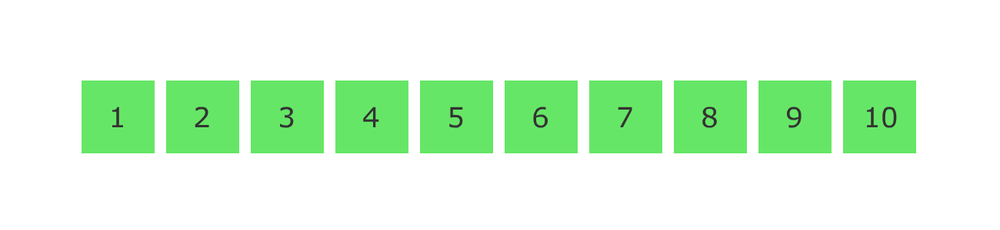

## RTP

RTP — "Real-time Transport Protocol" — is a common protocol used to stream data (typically media, i.e. audio and video)
over the internet, in real-time. The starter code contains a simple implementation of an RTP transmitter and an RTP
receiver.

## Quick Start

To install dependencies, run

```
npm install
```

The `data` directory contains a single file, `input.ulaw`. In one terminal tab, run

```
npm run receive
```

and in another one, run

```
npm run transmit
```

The transmitter will read the data from `input.ulaw` and send it as a stream of RTP packets to the receiver, in real
time. When all of the data is transmitter (this will take a few seconds), both processes will shut themselves down, and
the receiver will write an `output.ulaw` file to the `data` directory. The two files should be identical.

## RTP List

RTP List is a model which provides advantages of sorted map and priority queue. The model doesn't allow duplicates:

```
    public pushItem(packet: RTPPacket): void {
        if (!this.packetsMap[packet.sequenceNumber]) {
            ...
        }
    }
```

Lowest priority elements are removed first.

```
    public shiftItem(): RTPPacket | undefined {
        if (this.sequenceNumbers.length > 0 && !!this.packetsMap[this.sequenceNumbers[0]]) {
            const packet = this.packetsMap[this.sequenceNumbers[0]];
            ...
        }
    }
```

Data in the RtpMapModel is preserved as a map where the `sequenceNumber` is used as a key. Map provides random access 1. At
the same time, for preserving proper order, the `sequenceNUmber` is added to array which is sorted in ascending order on
each addition.

```
    public pushItem(packet: RTPPacket): void {
            ...
            this.sequenceNumbers.sort((a, b) => a - b);
            ...
    }
```

## Receiver

In order to avoid accumulation of all packages in the memory, only small size buffer of packages are preserved in the
RtpMapModel. Due to the transmitter provides packets out-of-order, the buffer is supposed to be a big enough to assure
proper order.

Based on running the transmitter, there was found out dispersion of packets is about five, e.g.:

```
    643, 642, 645, 644, 646
```

therefore, the initial minimum size of the RtpMapModel is set as ten.


Nonetheless, the buffer size could be adjusted. For example, based on validation statics and logs, there could be
established proper buffer size, it could be done even in real-time. For example, the sequence below is sorted;
nonetheless, it is lacking multiple packets due to the difference between sequence numbers is not supposed to be bigger
than 1:

```
    10, 20, 32, 42, 51, 62, 70, 83, 92, 101
```

In this case scenario, the size of the buffer could be adjusted in order to accommodate more elements for sorting them
properly.

```
    10, 11, 12, 20, 21, 24, 32, 33, 25, 40, 41, 42, 51, 62, 70, 83, 92, 94, 98, 101
```

Meantime, on each adding, the list is sorted, so the first element has the lowest `sequenceNumber`. After being sorted,
the packets could be removed from the list. Everything is done in realtime, so, in any giving moment, only small part of
the packets a preserved in the memory.



## LoggingService, Validation, Fallback

### LoggingService

All received packets, — with duplicates and out-of-order, — are logged in the cloud, AWS DynamoDB and AWS S3.


Due to packets preserved with sequence numbers and timestamps, in any given moment, state of transaction or entire file
could be recreated.

Besides logging received packets, all appended packets logged as well. In this case, there are supposed to be packets
without duplication and sorted sequence numbers. The appended packets logs could be used for detecting any types of
anomalies (e.g. drop packets, packets out-of-order, etc.).


### Validation and Fallback

As soon the packet transmission is finished, the validation is triggered. Based on logged appended packets, the
validation verifies if all packets were added properly in order, and there are no drop packets. In order to do so, both
sequence number and timestamp are used.


If any discrepancies are detected, reacretion of the file is triggered. THe recreation uses logged packets from the
DynamoDB, and result is preserved on the AWS S3 bucket. State machine of the validation


## Code structure


`/src`:

- `receiver.ts` contains the code that powers `npm run receive`

- `transmitter.ts` contains the code that powers `npm run transmit`


`/models`:

- `rtp-map.model.ts` a data structure in order to preserve packets as a sorted dictionary

- `rtp-packet.ts` contains a utility class that implements encoding and decoding RTP packets


`/services`:

- `file-processor.service.ts` provides basic functionality for processing a file stream. It uses a `fs`

- `logging.service.ts` provides logging functionality. Logs could be preserved in AW DynamoDB and S3

- `validation.ts` triggers validation in order to verify if all packets preserved properly


`/lambdas`:

- `logPacket.js` logs received packet

- `logAppend.js` logs appended packet

- `getAppendsLogs.js` returns `sequenceNumber` of appended packets

- `recreateTable.js` triggers a state machine which recreates DynamoDB tables for development purposes

- `deleteTable.js` deletes DynamoDB table for development purposes

- `createTable.js` create a new DynamoDB table

- `uploadPacket.js` uploads a packet to S3

- `validateAppends.js`  processes basic validation of appended packets

- `createFile.js`  creates a file if the validation fails

- `returnSuccess.js`  returns success if the validation passes successfully


`/state-machines`:

- `recreateTable.json` state machine for recreating DynamoDB tables for testing purposes

- `validateOutput.json` state machine which contains a sequence of lambda functions for processing validation, and
  returning a file if validation returns `false`

## State Machines for tables recreation


For developing purposes, there was created a state machine for recreating DynamoDB in order to have empty tables on each
run


